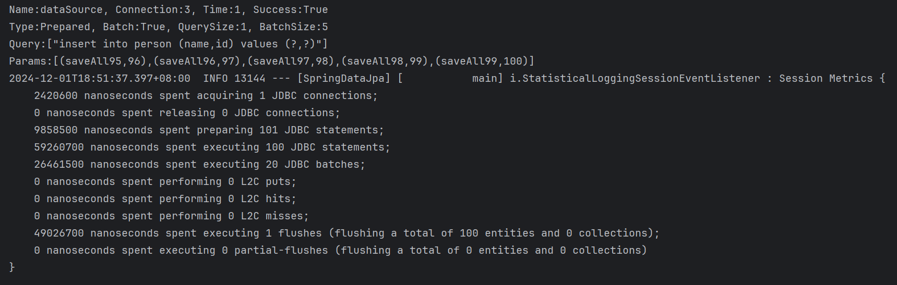

## Env

DB

```shell
docker run --env=POSTGRES_PASSWORD=postgre --env=PGDATA=/var/lib/postgresql/data --volume=D:\Environment\Docker\PostgreSQL:/var/lib/postgresql/data --volume=/var/lib/postgresql/data --workdir=/ -p 5432:5432 -d postgres:16
```
dependenccies
```
spring-boot-starter-data-jpa：3.2.0
postgresql:42.8.0
```
properties
```properties
spring.application.name=SpringDataJpa
spring.jpa.properties.hibernate.jdbc.use_get_generated_keys=trues
spring.jpa.properties.hibernate.jdbc.batch_size=5
spring.jpa.properties.hibernate.jdbc.batch_versioned_data=true
spring.jpa.properties.hibernate.order_inserts=true
spring.jpa.properties.hibernate.order_updates=true
spring.jpa.properties.hibernate.generate_statistics=true
spring.jpa.properties.hibernate.show_sql=true
#spring.jpa.properties.hibernate.format_sql=true
spring.datasource.driver-class-name=org.postgresql.Driver
spring.datasource.url=jdbc:postgresql://localhost:5432/postgres?&rewriteBatchedStatements=true
spring.datasource.username=postgres
spring.datasource.password=postgre
#spring.jpa.hibernate.ddl-auto=create
logging.level.net.ttddyy.dsproxy.listener=debug
```


批量插入100条数据

## case1 properties设置batch_size、SQL设置sequence increment size、Entity设置allocationSize均为5, 成功20 JDBC batches

spring.jpa.properties.hibernate.jdbc.batch_size=5

create sequence person_id_seq start with 1 increment by 5 minvalue 1 no maxvalue;

@SequenceGenerator(name = "person_id_gen", sequenceName = "person_id_seq", allocationSize = 5

```
2024-12-01T17:57:24.584+08:00 DEBUG 9148 --- [SpringDataJpa] [           main] n.t.d.l.l.SLF4JQueryLoggingListener      : 
Name:dataSource, Connection:4, Time:0, Success:True
Type:Prepared, Batch:True, QuerySize:1, BatchSize:5
Query:["insert into person (name,id) values (?,?)"]
Params:[(saveAll95,96),(saveAll96,97),(saveAll97,98),(saveAll98,99),(saveAll99,100)]
2024-12-01T17:57:24.613+08:00  INFO 9148 --- [SpringDataJpa] [           main] i.StatisticalLoggingSessionEventListener : Session Metrics {
    1728500 nanoseconds spent acquiring 1 JDBC connections;
    0 nanoseconds spent releasing 0 JDBC connections;
    1254500 nanoseconds spent preparing 22 JDBC statements;
    13649100 nanoseconds spent executing 21 JDBC statements;
    16964300 nanoseconds spent executing 20 JDBC batches;
    0 nanoseconds spent performing 0 L2C puts;
    0 nanoseconds spent performing 0 L2C hits;
    0 nanoseconds spent performing 0 L2C misses;
    33533500 nanoseconds spent executing 1 flushes (flushing a total of 100 entities and 0 collections);
    0 nanoseconds spent executing 0 partial-flushes (flushing a total of 0 entities and 0 collections)
}
```



## case2 properties将batch_size设置为10, 成功 10 JDBC batches

batch size为10，sequence 5, allocationSize 5

```shell
2024-12-01T18:03:01.552+08:00 DEBUG 25564 --- [SpringDataJpa] [           main] n.t.d.l.l.SLF4JQueryLoggingListener      : 
Name:dataSource, Connection:4, Time:0, Success:True
Type:Prepared, Batch:True, QuerySize:1, BatchSize:10
Query:["insert into person (name,id) values (?,?)"]
Params:[(saveAll90,91),(saveAll91,92),(saveAll92,93),(saveAll93,94),(saveAll94,95),(saveAll95,96),(saveAll96,97),(saveAll97,98),(saveAll98,99),(saveAll99,100)]
2024-12-01T18:03:01.566+08:00  INFO 25564 --- [SpringDataJpa] [           main] i.StatisticalLoggingSessionEventListener : Session Metrics {
    1951400 nanoseconds spent acquiring 1 JDBC connections;
    0 nanoseconds spent releasing 0 JDBC connections;
    1516600 nanoseconds spent preparing 22 JDBC statements;
    14453700 nanoseconds spent executing 21 JDBC statements;
    11774800 nanoseconds spent executing 10 JDBC batches;
    0 nanoseconds spent performing 0 L2C puts;
    0 nanoseconds spent performing 0 L2C hits;
    0 nanoseconds spent performing 0 L2C misses;
    31770700 nanoseconds spent executing 1 flushes (flushing a total of 100 entities and 0 collections);
    0 nanoseconds spent executing 0 partial-flushes (flushing a total of 0 entities and 0 collections)
}
```


## case3 sequence incrementBy 设置为10， 异常

batch_size=5, increment by 10,  allocationSize = 5

```shell
org.hibernate.MappingException: The increment size of the [person_id_seq] sequence is set to [5] in the entity mapping while the associated database sequence increment size is [10].
```


## case4 allocationSize = 10, 异常

batch_size=5,  increment by 5,  allocationSize = 10

```shell
org.hibernate.MappingException: The increment size of the [person_id_seq] sequence is set to [10] in the entity mapping while the associated database sequence increment size is [5].
```


## case5 batch_size=5, increment by 1 , allocationSize = 5 异常

```shell
org.hibernate.MappingException: The increment size of the [person_id_seq] sequence is set to [5] in the entity mapping while the associated database sequence increment size is [1].
```


## case6 batch_size=5, increment by 1, , allocationSize = 1 成功 20JDBC batches

```shell
2024-12-01T18:16:40.275+08:00 DEBUG 14132 --- [SpringDataJpa] [           main] n.t.d.l.l.SLF4JQueryLoggingListener      : 
Name:dataSource, Connection:3, Time:0, Success:True
Type:Prepared, Batch:True, QuerySize:1, BatchSize:5
Query:["insert into person (name,id) values (?,?)"]
Params:[(saveAll95,96),(saveAll96,97),(saveAll97,98),(saveAll98,99),(saveAll99,100)]
2024-12-01T18:16:40.285+08:00  INFO 14132 --- [SpringDataJpa] [           main] i.StatisticalLoggingSessionEventListener : Session Metrics {
    1971400 nanoseconds spent acquiring 1 JDBC connections;
    0 nanoseconds spent releasing 0 JDBC connections;
    9196800 nanoseconds spent preparing 101 JDBC statements;
    64574700 nanoseconds spent executing 100 JDBC statements;
    20074500 nanoseconds spent executing 20 JDBC batches;
    0 nanoseconds spent performing 0 L2C puts;
    0 nanoseconds spent performing 0 L2C hits;
    0 nanoseconds spent performing 0 L2C misses;
    39952600 nanoseconds spent executing 1 flushes (flushing a total of 100 entities and 0 collections);
    0 nanoseconds spent executing 0 partial-flushes (flushing a total of 0 entities and 0 collections)
}
```


实际上设置 `spring.jpa.properties.hibernate.jdbc.batch_size=10` 即可